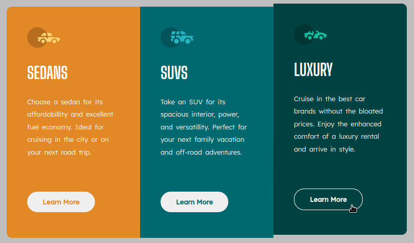

# FRONTEND MENTOR - 3 Column Card Component

# Table of contents
- Overview
    - The challenge
    - Screenshots
    - Links
- My process
    - Built with
- Author

## Overview

### The challenge

Users should be able to:

- View the optimal layout depending on their device's screen size
- See hover states for interactive elements

### Screenshots

### Links

- Solution URL: [Solution URL]()
- Live Site URL: [Live Site URL]()

### Personal addition

## My process

### Built with 

- Semantic HTML5 markup
- CSS custom properties
- Flexbox
- Sass(SCSS syntax) - functions, variables and mixins

## Author

- Frontend Mentor - [@graple-guillos](frontendmentor.io/profile/graple-guillos)
